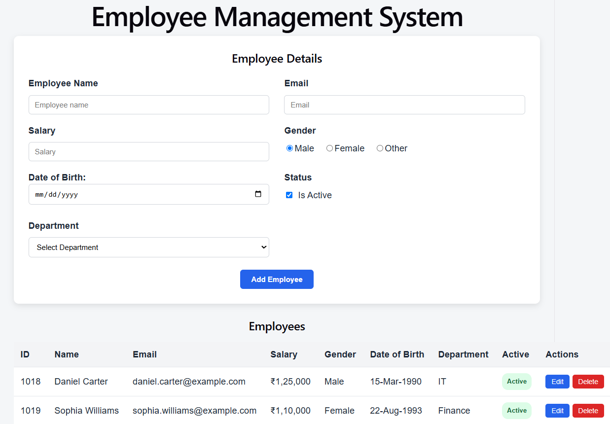

# Employee Management System - Full-Stack Application

A full-stack Employee Management application built using **React, TypeScript, ASP.NET Core Web API, Entity Framework Core, and SQL Server**.

The application demonstrates end-to-end CRUD operations with a React frontend communicating with an ASP.NET Core REST API.

## Application Screenshot



## Technologies Used

### Frontend
- React
- TypeScript
- Vite
- HTML5
- CSS3
- Fetch API

### Backend
- C#
- ASP.NET Core Web API
- Entity Framework Core
- REST APIs
- DTOs
- CORS

### Database
- SQL Server
- SQL Server LocalDB
- Entity Framework Core Migrations

### Development & Version Control
- Visual Studio
- Visual Studio Code
- Git
- GitHub

## Features

- View employees
- Add new employees
- Edit existing employees
- Delete employees
- Delete confirmation
- Department dropdown populated from the API
- Employee and Department relational data
- Gender selection
- Active / Inactive employee status
- Date of Birth handling
- Future Date of Birth restriction
- Frontend field validation
- Backend DTO validation
- Field-specific validation messages
- Success messages for Add, Update, and Delete
- Automatic success-message timeout
- Professional responsive form layout
- REST API integration
- CORS configuration
- Entity Framework Core migrations

## Application Architecture

```text
React + TypeScript Frontend
          |
          | HTTP / REST
          | GET / POST / PUT / DELETE
          v
ASP.NET Core Web API
          |
          | Entity Framework Core
          v
      SQL Server
```

## CRUD Operations

| Operation | HTTP Method | Purpose |
|---|---|---|
| Create | POST | Add a new employee |
| Read | GET | Retrieve employees |
| Update | PUT | Update an existing employee |
| Delete | DELETE | Delete an employee |

## Project Structure

```text
React-DotNet-WebAPI-EmployeeManagement/
|
|-- EmployeeManagementAPI/
|   |-- Controllers/
|   |-- Data/
|   |-- DTOs/
|   |-- Migrations/
|   |-- Models/
|   |-- Program.cs
|   `-- appsettings.json
|
|-- employee-management-ui/
|   `-- src/
|       |-- components/
|       |   |-- EmployeeForm.tsx
|       |   `-- EmployeeGrid.tsx
|       |
|       |-- models/
|       |   |-- Department.ts
|       |   `-- Employee.ts
|       |
|       |-- services/
|       |   |-- departmentService.ts
|       |   `-- employeeService.ts
|       |
|       |-- App.tsx
|       `-- App.css
|
`-- React-DotNet-WebAPI-EmployeeManagement.slnx
```

## API Endpoints

### Employees

```text
GET     /api/employees
POST    /api/employees
PUT     /api/employees/{id}
DELETE  /api/employees/{id}
```

### Departments

```text
GET     /api/departments
```

## Validation

Validation is implemented at both the frontend and backend levels.

Frontend validation provides immediate user-friendly field validation, while backend DTO validation protects the API from invalid requests.

Examples include:

- Employee Name is required
- Valid Email is required
- Salary must be greater than zero
- Date of Birth is required
- Future Date of Birth selection is restricted
- Department selection is required

## Running the Application

### Backend

Open the solution in Visual Studio and run the `EmployeeManagementAPI` project.

The development API is configured to run locally.

### Database

The application uses SQL Server LocalDB.

The database can be created from the Entity Framework Core migrations.

### Frontend

Navigate to:

```text
employee-management-ui
```

Install the dependencies:

```bash
npm install
```

Start the React development server:

```bash
npm run dev
```

Then open the local URL displayed by Vite in the browser.

## Key Learning Areas

This project provided hands-on experience with:

- Building a React application using TypeScript
- Building REST APIs with ASP.NET Core
- Connecting React to ASP.NET Core Web API
- Asynchronous programming with `async` / `await`
- JavaScript Promises
- React state and props
- React component design
- CRUD operations
- HTTP methods and status codes
- DTO-based API design
- Entity Framework Core
- SQL Server integration
- CORS
- Frontend and backend validation
- Git and GitHub version control

## Author

**Praveen Puthran**

Senior .NET / C# Technical Lead & Software Engineer

Core technologies: C#, .NET, ASP.NET Core, WPF, SQL Server, React, TypeScript, Web API and Azure.